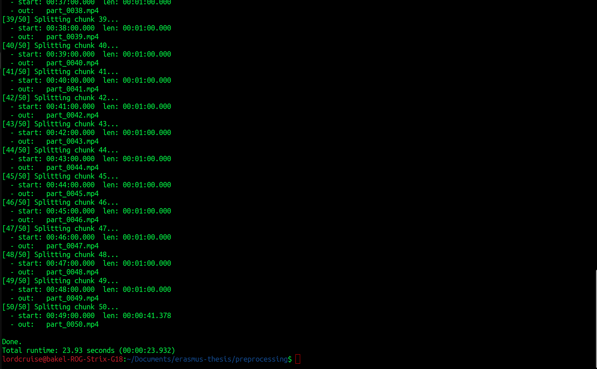
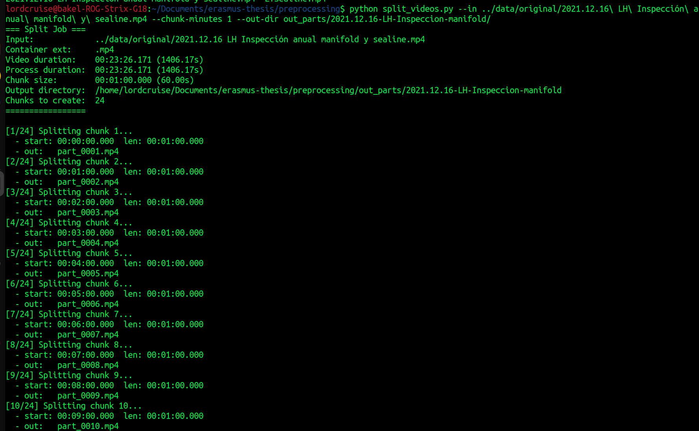
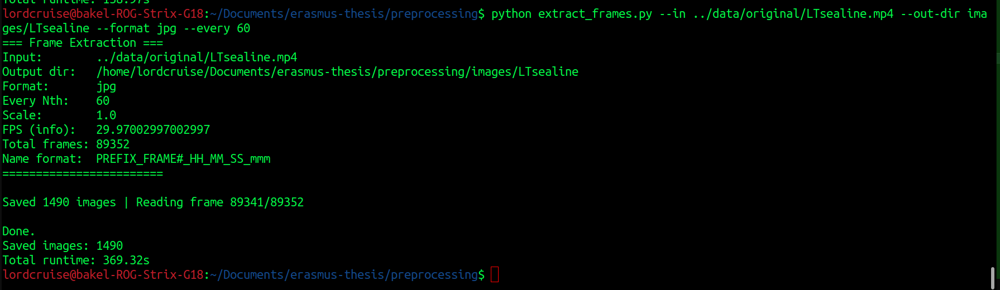

# Erasmus Thesis - Video Processing Tools

This repository contains Python scripts for processing video files, particularly for pipe inspection and analysis tasks.

## Overview

The codebase includes tools for:
- Splitting large video files into smaller chunks
- Extracting frames from videos for training datasets

## Requirements

### Dependencies

- **Python 3.7+**
- **OpenCV** (`cv2`) - for video processing and computer vision
- **NumPy** - for numerical operations
- **FFmpeg** - for video splitting (must be installed on system)

Install Python dependencies:
```bash
pip install opencv-python numpy
```

Install FFmpeg:
- **Ubuntu/Debian**: `sudo apt-get install ffmpeg`
- **macOS**: `brew install ffmpeg`
- **Windows**: Download from [ffmpeg.org](https://ffmpeg.org/download.html)

## Scripts

### 1. `preprocessing/split_videos.py`

Splits a large video file into smaller chunks while preserving the original codec and quality using FFmpeg stream copy (no re-encoding).

#### Usage

```bash
python preprocessing/split_videos.py --in <input_video> --chunk-minutes <minutes> [options]
```

#### Arguments

- `--in` (required): Input video file path
- `--chunk-minutes` (required): Length of each output chunk in minutes (e.g., `1` for 1-minute chunks)
- `--out-dir` (optional): Output directory for split videos (default: `splits`)
- `--total-minutes` (optional): How many minutes from the start to process (default: entire video)
- `--prefix` (optional): Filename prefix for output files (default: `part`)

#### Example

```bash
python preprocessing/split_videos.py \
    --in ../data/original/LTsealine.mp4 \
    --chunk-minutes 1 \
    --out-dir out_parts/LTsealine/
```

This creates 1-minute video chunks named `part_0001.mp4`, `part_0002.mp4`, etc.

#### Notes

- Uses FFmpeg stream copy for fast processing without quality loss
- Output files maintain the same container format as the input
- All chunks are created properly with accurate seeking

---

### 2. `preprocessing/extract_frames.py`

Extracts frames from video files and saves them as individual images. Useful for creating training datasets or analyzing specific frames.

#### Usage

```bash
python preprocessing/extract_frames.py --in <input_video> [options]
```

#### Arguments

- `--in` (required): Input video file path
- `--out-dir` (optional): Output directory for extracted frames (default: `frames`)
- `--format` (optional): Image format - `png` or `jpg` (default: `png`)
- `--prefix` (optional): Filename prefix (default: `frame`)
- `--every` (optional): Save every Nth frame (default: `1` = save all frames)
- `--scale` (optional): Resize factor (e.g., `0.5` for half size, default: `1.0`)
- `--start-ms` (optional): Timestamp offset in milliseconds (default: `0.0`)

#### Example

```bash
python preprocessing/extract_frames.py \
    --in ../data/original/LTsealine.mp4 \
    --out-dir frames/LTsealine \
    --format jpg \
    --every 60 \
    --prefix frame
```

This extracts every 60th frame (approximately 1 frame per 2 seconds for 30 FPS video) and saves them as JPG files.

#### Output Format

Frames are saved with the naming pattern:
```
PREFIX_FRAMENUMBER_HH_MM_SS_mmm.format
```

Example: `frame_000001_00_01_23_456.jpg`

---

## My Use Case

### Video Processing Workflow

For processing large video files for machine learning training:

#### Step 1: Split Video into Manageable Chunks


Split the large video file into smaller 1-minute segments:

```bash
python preprocessing/split_videos.py \
    --in ../data/original/LTsealine.mp4 \
    --chunk-minutes 1 \
    --out-dir out_parts/LTsealine/
```

This creates multiple smaller video files that are easier to process and manage.







#### Step 2: Extract Frames for Training Data

Extract frames from the videos with a sampling period of 2 seconds (taking 1 frame every 60 frames for 30 FPS video):

```bash
python preprocessing/extract_frames.py \
    --in <video_file> \
    --out-dir frames/LTsealine \
    --format jpg \
    --every 60 \
    --prefix frame
```

**Calculation**: For a 30 FPS video:
- 1 frame every 60 frames = 1 frame every 2 seconds
- This provides a good sampling rate for training datasets while keeping file sizes manageable




---

## Project Structure

```
erasmus-thesis/
├── data/
│   ├── original/          # Original video files
│   ├── shorts/            # Short video clips
│   └── images/            # Extracted frame images
├── preprocessing/
│   ├── split_videos.py    # Video splitting script
│   ├── extract_frames.py  # Frame extraction script
│   └── short_videos/      # Output directory for split videos
└── README.md              # This file
```

---

## Technical Notes

### Video Splitting (`split_videos.py`)

- Uses FFmpeg with `-ss` after `-i` for accurate seeking
- Stream copy mode (`-c copy`) preserves original quality without re-encoding
- Handles timestamp issues with `-avoid_negative_ts make_zero`
- All chunks are created properly, even when starting from non-keyframe positions

### Frame Extraction (`extract_frames.py`)

- Uses OpenCV for video reading and frame extraction
- Timestamps are calculated from video decode position
- Supports resizing for memory efficiency
- Handles videos with unknown frame counts gracefully

---

## Troubleshooting

### FFmpeg Not Found
If you get "ffmpeg: command not found", ensure FFmpeg is installed and in your system PATH.

### Empty Video Chunks
If video chunks are empty or corrupted, ensure you're using the latest version of `split_videos.py` which uses accurate seeking.

### Memory Issues
For very large videos, use the `--scale` parameter to reduce resolution during processing.

---

## License

This code is part of an Erasmus thesis project.
